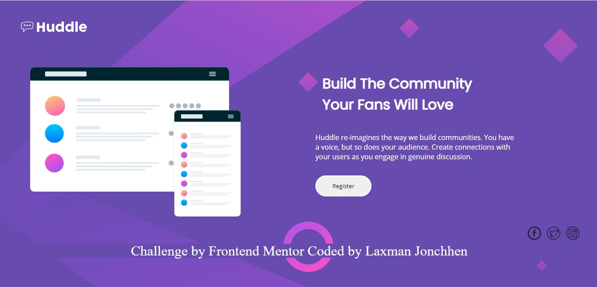

# Frontend Mentor - Huddle landing page with single introductory section solution

This is a solution to the [Huddle landing page with single introductory section challenge on Frontend Mentor](https://www.frontendmentor.io/challenges/huddle-landing-page-with-a-single-introductory-section-B_2Wvxgi0). Frontend Mentor challenges help you improve your coding skills by building realistic projects.

## Table of contents

- [Overview](#overview)
  - [The challenge](#the-challenge)
  - [Screenshot](#screenshot)
  - [Links](#links)
- [My process](#my-process)
  - [Built with](#built-with)
  - [What I learned](#what-i-learned)
  - [Continued development](#continued-development)
- [Author](#author)

## Overview

### The challenge

Users should be able to:

- View the optimal layout for the page depending on their device's screen size
- See hover states for all interactive elements on the page

### Screenshot

### Links

- Solution URL: [Github](https://github.com/LaxmanJonchhen12/huddle-landing-page-challenge)
- Live Site URL: [Netlify](https://wonderful-carson-089f2f.netlify.app/)

## My process

I discovered in frontendmentor stire and saw the challenge downloaded the challenge files. First completed the desktop version and then completed the mobile layout.

### Built with

- Semantic HTML5 markup
- CSS custom properties

### What I learned

During this challenge i learned responsive web design process.

### Continued development

I want continue my focus on learning and improving in frontend technologies.

## Author

- Website - [LaxmanJonchhen](https://laxmanjonchhen12.github.io/)
- Frontend Mentor - [@LaxmanJonchhen12](https://www.frontendmentor.io/profile/LaxmanJonchhen12)
- Twitter - [@LaxmanJonchhen5](https://twitter.com/LaxmanJonchhen5)
